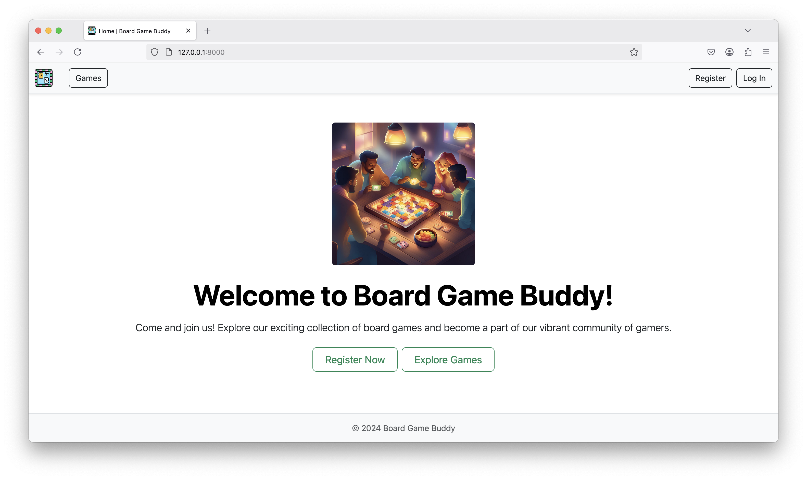
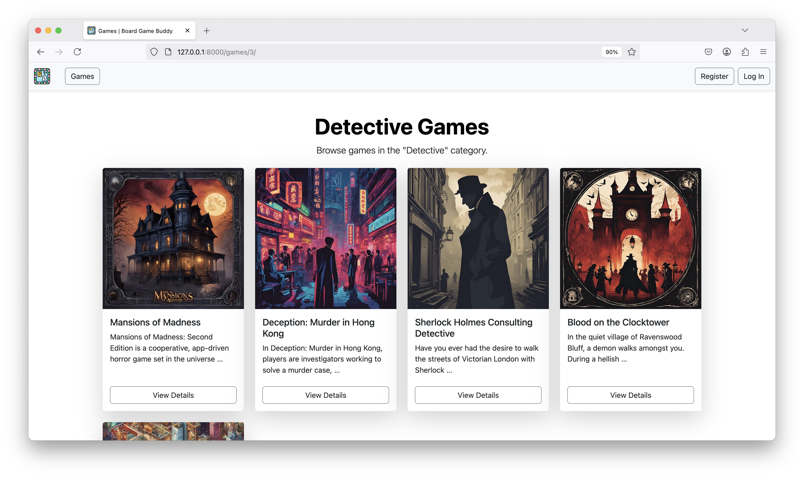

# Board Game Buddy

[](https://www.python.org/)
[](https://www.djangoproject.com/)
[](https://getbootstrap.com/)
[](https://www.sqlite.org/)

## Overview

**Board Game Buddy** is a Django-based web application that helps groups of friends manage board game collections and lending. Users can register, add and manage games, borrow up to 3 at a time, and track history.

## Features

- User registration and authentication
- Add, edit, and delete games
- Browse games by category
- Borrow/return with a 3-game limit
- Timestamps for tracking activity

---

## Technologies Used

- Python 3.x
- Django
- SQLite
- Bootstrap 5
- HTML5 & CSS3

## Screenshots

<h3 align="center">Home Page</h3>



<h3 align="center">Category List</h3>


<h3 align="center">Game List in Category</h3>



<h3 align="center">Game Detail Page</h3>


<h3 align="center">Registration Page</h3>


## Directory Structure

The project follows standard Django structure, including:

- `bgb_project/`: project configuration
- `boardgames/`: main app with models, views, templates, and forms
- `fixtures/`: example data in JSON
- `media/`: user-uploaded files
- `requirements.txt`: project dependencies

## Getting Started

### Prerequisites

- Python 3.x installed on your system
- Pip for Python package management

### Installation Steps

1. **Clone the repository**:

   ```bash
   git clone <repository-url>
   cd board-game-buddy
   ```

2. **Create a virtual environment**:

   ```bash
   python -m venv .venv
   ```

3. **Activate the virtual environment**:

   - On macOS and Linux:

     ```bash
     source .venv/bin/activate
     ```

   - On Windows:

     ```bash
     .venv\Scripts\activate
     ```

4. **Install dependencies**:

   ```bash
   pip install -r requirements.txt
   ```

5. **Apply database migrations**:

   ```bash
   python manage.py migrate
   ```

6. **Create a superuser**:

   ```bash
   python manage.py createsuperuser
   ```

7. **Load initial data** (optional, for predefined categories and games):

   ```bash
   python manage.py loaddata categories.json
   python manage.py loaddata games.json
   ```

8. **Run the development server**:

   ```bash
   python manage.py runserver
   ```

App will be available at http://127.0.0.1:8000/

## Testing

To run the test suite, use the following command:

```bash
python manage.py test
```

## Usage

1. Sign up and log in.
2. Add your own board games or browse existing ones.
3. View game details by category or from the homepage.
4. Borrow up to 3 games at a time.
5. Return games when finished.
6. Track your lending and borrowing history.
